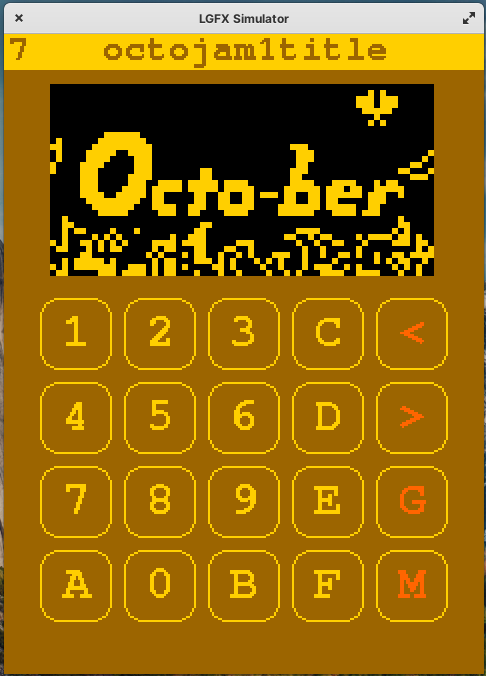
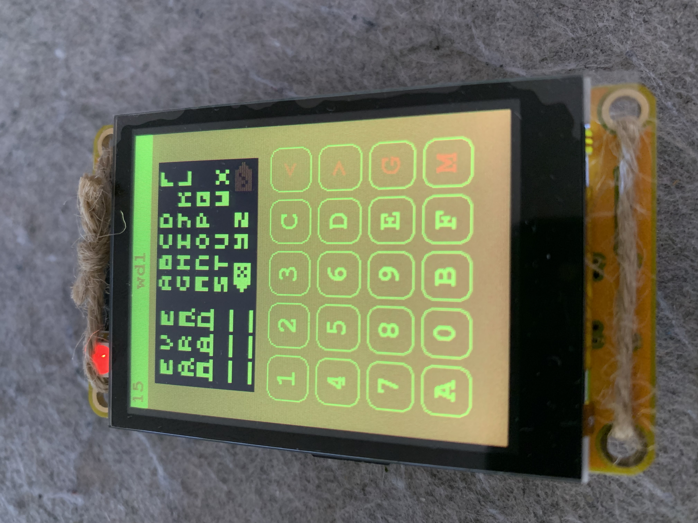
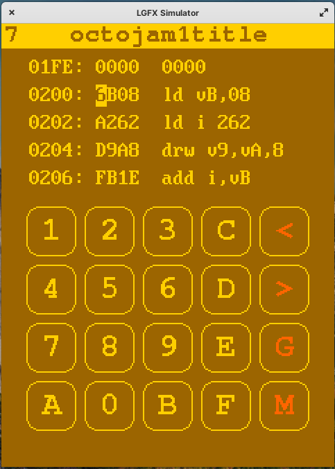
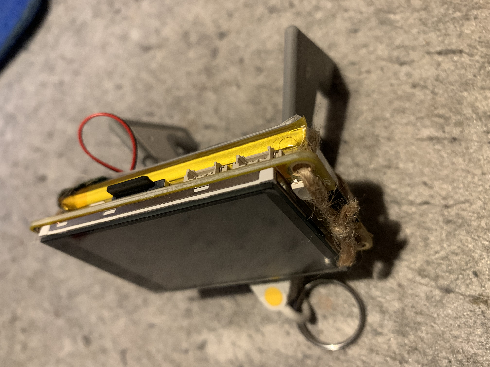
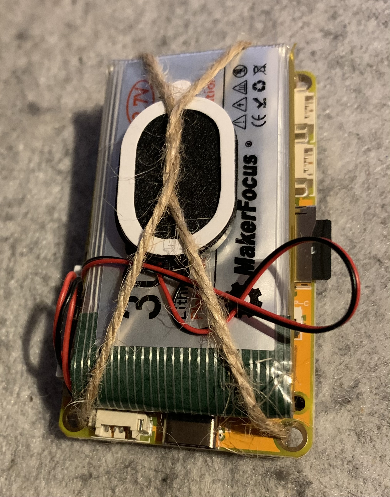
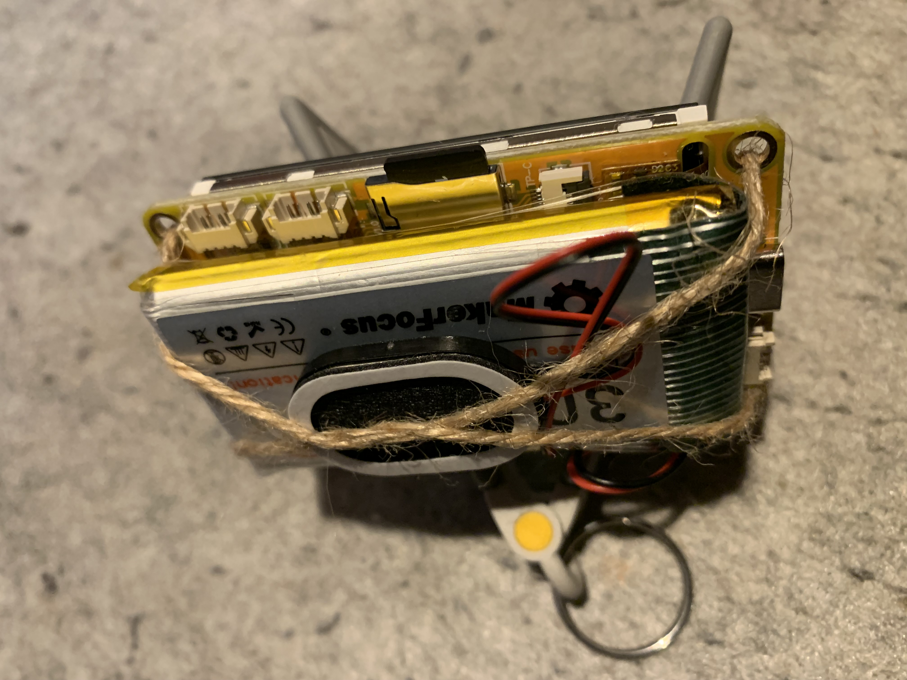
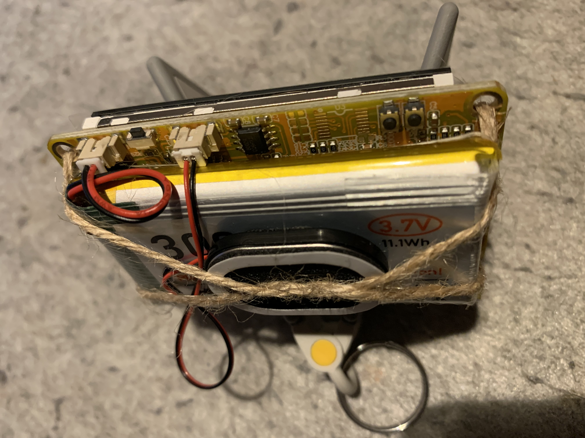
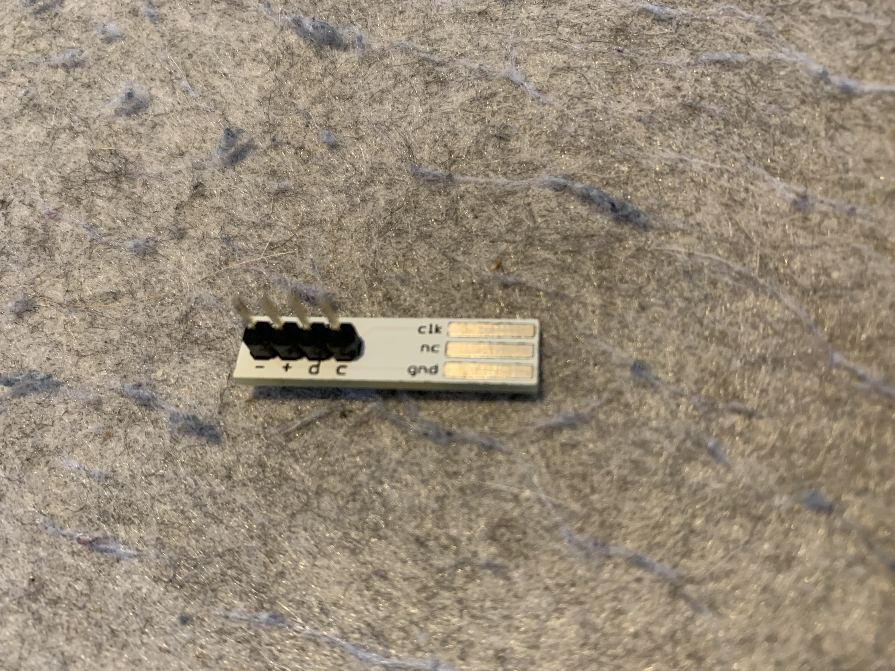
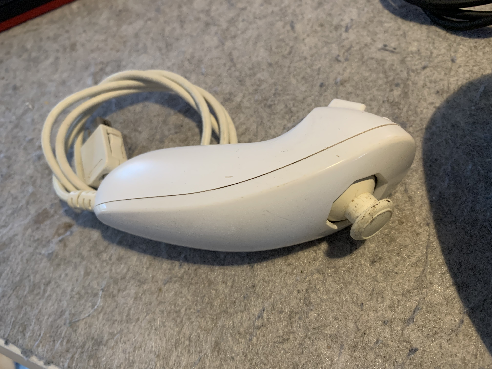

# ESP-Octo

Port of the wonderful [Octo](https://github.com/JohnEarnest/c-octo.git) (just the emulator, not the complete IDE) by John Earnest to [ESP32-2432S024C](https://www.aliexpress.com/item/1005005865107357.html) with capacitive touch.

The UI is self-contained. The 320x240 pixel display shows the classic CHIP-8 hex display, extended by four buttons to browse games from [the CHIP-8 archive]() ("<", ">", "G") or switch to the built-in monitor and disassembler ("M").

The goal is to create a cheap, self-contained gadget that allows to examine and write fun games completely without a connected computer. 

There are versions for small ESP32-based boards as well as a simulator for desktop PCs (currently tested on Linux; should work on macOS).

## Checkout

Use "git clone --recursive" to get the required submodules.

## Touch

The touch interface is a CST820, connected with I2C. This is not supported by LovyanGFX. The board file specifies a CST816S, connected with SPI. I couldn't get this to work. Instead, I use files CST820.{cpp,hpp} from https://github.com/NoosaHydro/2.4inch_ESP32-2432S024.git

## Games

There are ~100 games from [the CHIP-8 archive](https://johnearnest.github.io/chip8Archive/) in "vendor/chip8Archive/roms". Put them in an SDcard in directory "/chip8". Also, put file "chip8.txt" in the root directory of this SDcard. This file is created from "chip8Archive/programs.json" with a small Python script.

## The Board

The ESP32-2432S024C is one of the _Sunton_ branded yellow ESP32 boards with a display. It is an even smaller and cheaper sibbling to the _[Cheap Yellow Display](https://github.com/topics/cheap-yellow-display). I have attached a rechargable battery ([3,7V 3000mAh LiPo Akku](https://amzn.to/3uwWGVx) - affiliate link) and a small speaker ([Adafruit Mini-Lautsprecher, oval, 8 Ohm, 1 Watt (3923)](https://amzn.to/3I1CT3r) - affiliate link) to their respective JST 1.25 connectors.

Here are some pictures:

Obviously, the assembly needs to get a 3d-printed case.

## Accessories

The Nunchuk controller for the Wii connects via I2C. This makes it easy, with a small adapter, to support these as game controller.

 by [thingm](https://labs.thingm.com) - [Clone](https://amzn.to/3wkG3wN) - affiliate link

 - [Clone](https://amzn.to/48jkJVO) - affiliate link

2024-02-18: 

Sadly, I could not get neither of my Nunchuks to work with the [example code](https://raw.githubusercontent.com/witnessmenow/ESP32-Cheap-Yellow-Display/main/Examples/Projects/TetrisWithNunchuck/TetrisWithNunchuck.ino).

Also sad: Including _ESP Async WebServer_ leads to "DRAM segment data does not fit. Region `dram0_0_seg' overflowed by 11768 bytes". It seams it won't be possible to have a webserver in addition to the emulator.

It helps to dynamically allocate the emulator.